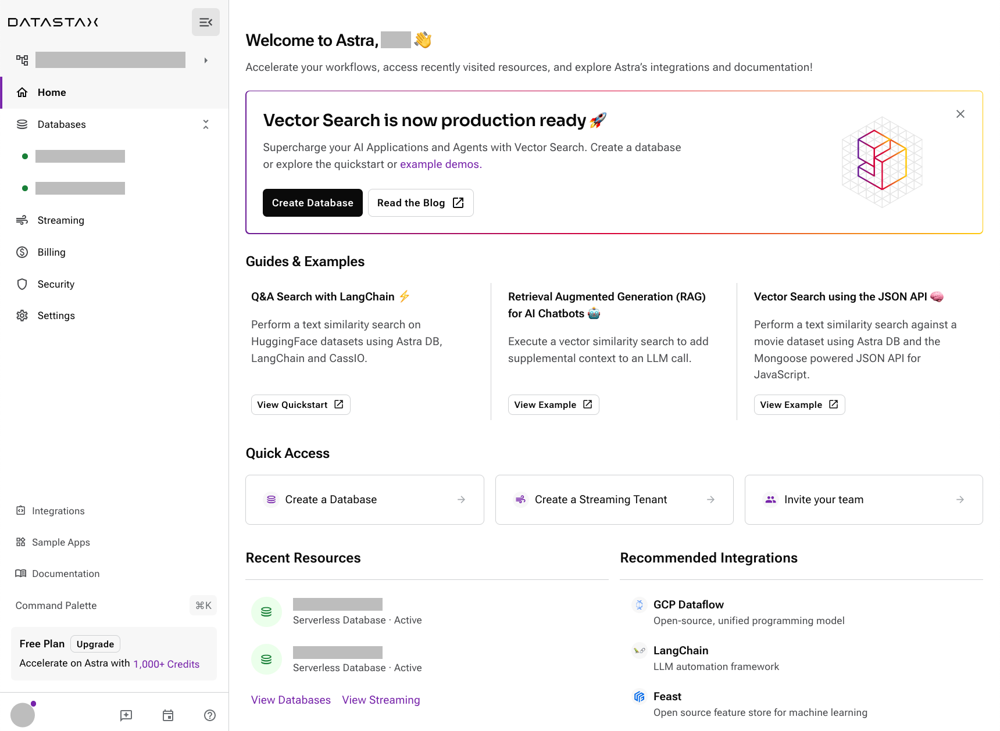
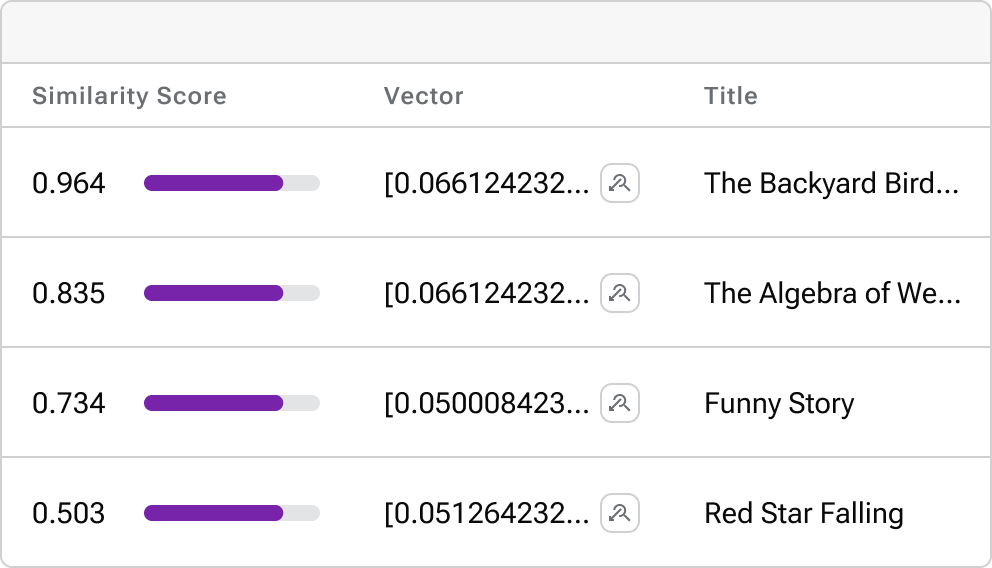
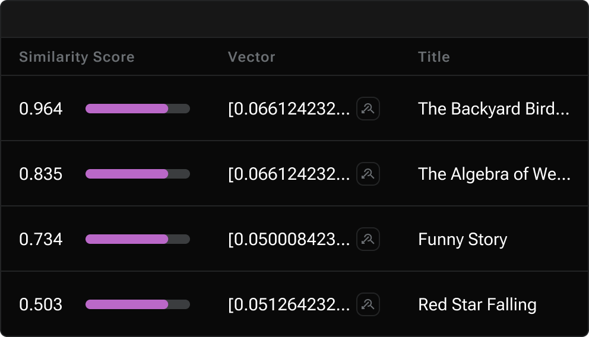

= Images, icons, and media
:idprefix:
:idseparator: -
:figure-caption!:

*Page source*: https://github.com/riptano/docs-ui/blob/main/preview-src/asciidoc/images.adoc

== Block images

.Optional title

=== Sizing and alignment

.width=400,align=left

.width=400 width,align=right

.width=400 width,align=center

=== Float

[.float-group]
--

In AsciiDoc, creating paragraphs is a straightforward process that does not require any special markup. A paragraph can be defined as one or more lines of consecutive text that are logically grouped together. To differentiate between paragraphs, you simply need to insert at least one blank line between them.
--

[.float-group]
--
image::../img/multirepo-ssg.svg[Multirepo SSG,300,float=left,role=float-gap]
In AsciiDoc, creating paragraphs is a straightforward process that does not require any special markup. A paragraph can be defined as one or more lines of consecutive text that are logically grouped together. To differentiate between paragraphs, you simply need to insert at least one blank line between them.
--

=== Light and dark mode images

You can make an image appear differently in light mode vs. dark mode.

==== Two separate images

[NOTE]
====
Define two images: one that looks good in light mode, and one that looks good in dark mode.
Then, assign the corresponding `for-light` and `for-dark` roles to each image.

* All non-SVG images, such as screenshot PNG files, must use this method.
* All SVG images that do not use <<svg-images-css,CSS variables>> must use this method.

[source,asciidoc]
----
image::vector-ui-light.png[alt="Alt text",width=400,role=for-light]
image::vector-ui-dark.png[alt="Alt text",width=400,role=for-dark]
----
====

[#svg-images-css]
==== SVG images with CSS variables

[NOTE]
======
Use the custom `svg` macro to define an SVG image that uses CSS variables to support light and dark mode.

[source,asciidoc]
----
svg::ROOT:illustration.svg[alt="Alt text",width=400]
----

The `svg` macro supports the following attributes: `width`, `height`, `role`, `alt`, and `title`.

[IMPORTANT]
====
CSS variables must use the tokens supported by the UI.
For example:

[source,svg,subs="+quotes"]
----
<svg viewBox="0 0 300 200" fill="none">
  <path fill="**var(--ds-text-primary)**" d="..." />
  <path stroke="**var(--ds-primary-outlined-border)**" d="..." />
  <path fill="**var(--ds-neutral-outlined-border)**" d="..." />
</svg>
----
====
======

// svg::../img/quickstart-overview.svg[]

[#icons]
== Icons

You can add icons in line with text and other elements.

[#font-icons]
=== Font icons

[NOTE]
======
Use the `icon` macro to invoke font icons from https://lucide.dev/icons/[Lucide Icons] and https://fonts.google.com/icons[Material Icons].
The `icon` macro follows https://developers.google.com/style/ui-elements#buttons[accessibility standards] and provides built-in support for light and dark mode.

Lucide is the default icon set.
You can invoke a Lucide icon with either `\icon:icon-name[]` or `\icon:lucide:icon-name[]`:

.Lucide
[source,asciidoc]
----
Click icon:settings[name="Settings"] to configure your settings. // <.>

icon:moon[alt="That's no moon"] // <.>

icon:atom[title="Split the atom"] // <.>

icon:star[role="text-amber-600 text-2xl"] // <.>

icon:star[size="60"] // <.>
----
<.> Use the `name` attribute to add visible text to the right of the icon.

<.> Use the `alt` attribute to define an `aria-label` label for the icon.
The text is invisible but is read by screen readers.
_Do not use `alt` if `name` or `title` is already defined._

<.> The `title` attribute does the same thing as `alt`, except the text is also visible as a tooltip on hover.
_Do not use `title` if `name` or `alt` is already defined._

<.> Use the `role` attribute to apply Tailwind CSS classes to the icon.

<.> Use the `size` attribute to define the icon size in pixels.

You can invoke a Material icon with `\icon:material:icon-name[]`.
All of the same attributes apply:

.Material
[source,asciidoc]
----
Click icon:material:settings[name="Settings"] to configure your settings.

icon:material:air[alt="Whooosh"]

icon:material:volume-up[title="Turn it up"]

icon:material:directions-boat[role="text-amber-600 text-2xl"]

icon:material:thumb-up[size=60]
----

.Legacy font icon methods
[%collapsible]
=====
[WARNING]
====
These methods were previously used to invoke font icons and should no longer be used.
====

Block or inline span with material-icons role::
+
--
Use the custom role `material-icons` on block or inline content. The content must be a material icon name in lower case. If there are spaces in the name, use underscores instead.

This method supports light and dark mode automatically.

.block style
[source]
----
[.material-icons]
thumb_up
----

.Inline style using a text span
[source]
----
Inline material icons [.material-icons]#thumb_up#
----

[.material-icons]#thumb_up# [.material-icons]#rocket_launch#
--

HTML passthrough::
+
--
Use block or inline HTML passthrough to create an icon element `<i class="icon-{icon-name}"></i>`.

This method supports light and dark mode automatically.

.Block passthrough
[source]
----
++++
<i class="icon-boom-box"></i>
++++
----

.Inline passthrough
[source]
----
Inline lucide icons +++<i class="icon-boom-box"></i>+++
----

+++<i class="icon-boom-box"></i>+++ +++<i class="icon-atom"></i>+++ +++<i class="icon-moon"></i>+++
--
=====
======

// Lucide::
// +
// Click icon:settings[name="Settings"] to configure your settings.
// +
// icon:moon[alt="That's no moon"]
// +
// icon:atom[title="Split the atom"]
// +
// icon:star[role="text-amber-600 text-2xl"]
// +
// icon:star[size="60"]

// Material::
// +
// Click icon:material:settings[name="Settings"] to configure your settings.
// +
// icon:material:air[alt="Whooosh"]
// +
// icon:material:volume-up[title="Turn it up"]
// +
// icon:material:directions-boat[role="text-amber-600 text-2xl"]
// +
// icon:material:thumb-up[size=60]

=== SVG icons

[NOTE]
======
Use the inline `svg` macro to display a local SVG file as an icon.

[source,asciidoc]
----
svg:ROOT:ui/icons/vector.svg[role="icon"] // <.>

svg:ROOT:ui/icons/vector.svg[role="icon text-2xl"] // <.>

Click svg:ROOT:ui/icons/vector.svg[role="icon text-2xl"] *Search* to run a similarity search based on the selected document's vector.
----

<.> The `icon` role adds CSS styles that pin the width and height of the image to the font size of the parent element.
Without the `icon` role, the image displays as large as possible unless a width and height is set in the SVG file itself (not recommended).

<.> Setting the `icon` role by itself usually leads to the icon appearing too small.
You can control the size of the icon with Tailwind `text-*` utilities, with `text-2xl` being the ideal size when the icon is used within body text.

[IMPORTANT]
====
Unlike <<font-icons,font icons>>, the `svg` macro doesn't automatically support light and dark mode.
You'll need to add supported <<svg-images-css,CSS variables>> to the SVG file for the icon to display properly in light and dark mode.
====
======

// Click svg:ROOT:ui/icons/vector.svg[role="icon text-2xl"] *Search* to run a similarity search based on the selected document's vector.

[#inline-images]
== Inline images

[IMPORTANT]
====
Avoid using inline images.
Use <<icons>> instead.
====

Click image:../img/play_circle_FILL0_wght400_GRAD0_opsz24.svg[title=Play] to get the party started.

Click image:../img/pause_circle_FILL0_wght400_GRAD0_opsz24.svg[title=Pause] when you need a break.

== Video

.YouTube (unconstrained; default alignment)
video::n_LcVqqHSY8[youtube]

.Vimeo (640x360; default alignment)
video::300817511[vimeo,640,360]

== Audio

.Take a zen moment
audio::ocean-waves.wav[]
