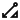

= Images and media
:idprefix:
:idseparator: -
:figure-caption!:

== Block images

.Optional title
image::../img/screenshot.png[Screenshot of Astra Portal Home]

=== Sizing and alignment

.400px width, align="left"
image::../img/screenshot.png[Screenshot of Astra Portal Home,400,align="left"]

.400px width, align="right"
image::../img/screenshot.png[Screenshot of Astra Portal Home,400,align="right"]

.400px width, align="center"
image::../img/screenshot.png[Screenshot of Astra Portal Home,400,align="center"]

=== Float

[.float-group]
--
image:../img/screenshot.png[Screenshot of Astra Portal Home,300,float=right,role=float-gap]
In AsciiDoc, creating paragraphs is a straightforward process that does not require any special markup. A paragraph can be defined as one or more lines of consecutive text that are logically grouped together. To differentiate between paragraphs, you simply need to insert at least one blank line between them.
--

[.float-group]
--
image::../img/multirepo-ssg.svg[Multirepo SSG,300,float=left,role=float-gap]
In AsciiDoc, creating paragraphs is a straightforward process that does not require any special markup. A paragraph can be defined as one or more lines of consecutive text that are logically grouped together. To differentiate between paragraphs, you simply need to insert at least one blank line between them.
--

== Inline images

Click image:../img/play_circle_FILL0_wght400_GRAD0_opsz24.svg[title=Play] to get the party started.

Click  when you need a break.

== Image theming (light/dark mode)

[NOTE]
======
You can define an image such that it appears differently in light mode vs. dark mode.
There are methods for doing this.

Method 1: Two separate images::
Define two images, one that looks good in light mode and one that looks good in dark mode.
Assign the corresponding roles -- `for-light` and `for-dark` -- to each image.
+
All non-SVG images, such as screenshot PNG files, must use this method.
All SVG images that do not use CSS variables must also use this method.
+
.block image
[source,asciidoc]
----
image::light-mode-illustration.png[Alt text,400,role=for-light]
image::dark-mode-illustration.png[Alt text,400,role=for-dark]
----
+
.inline image
[source,asciidoc]
----
Click the Astra Vector icon  .
----

Method 2: SVG image with CSS variables::
Use the custom `svg` macro to define an SVG image that uses CSS variables to support light and dark mode.
+
.block svg
[source,asciidoc]
----
svg::ROOT:illustration.svg[Alt text,400]
----
+
.inline svg
[source,asciidoc]
----
Click the Astra Vector icon svg:ROOT:your-diagram.svg[title="Astra Vector"].
----
+
[IMPORTANT]
====
CSS variables must use the tokens supported by the UI.
For example:

[source,svg]
----
<svg viewBox="0 0 300 200" fill="none">
  <path fill="var(--ds-text-primary)" d="..." />
  <path stroke="var(--ds-primary-outlined-border)" d="..." />
  <path fill="var(--ds-neutral-outlined-border)" d="..." />
</svg>
----
====
======

.themed block image
image::../img/light-mode-illustration.png[Alt text,400,role=for-light]

.themed block image
image::../img/dark-mode-illustration.png[Alt text,400,role=for-dark]

.themed inline image
Click the Astra Vector icon  .

== Icons

[NOTE]
======
You can define icons from https://fonts.google.com/icons?icon.set=Material+Icons&icon.style=Outlined[Material Icons,window=_blank] or an svg file using the customized `icon` macro or the `material-icons` role.

Method 1: Inline icon macro with an svg file::
The customized inline icon macro accepts a file path as it's target source. The file must be an svg file.
+
This methods supports using CSS variables within the svg.
+
[source]
----
icon:ROOT:ui/icons/vector.svg[]
----

Method 2: Inline icon macro with a material-icons target::
The customized inline icon macro supports material icon names as it's target source prefixed with `material-icons:`. Ensure the name is lower case with underscores instead of spaces.
+
This method supports light and dark mode automatically.
+
[source]
----
icon:material-icons:thumb_up[]
----

Method 3: material-icons role::
Use the custom role `material-icons` on block or inline content. The content must be a material icon name in lower case. If there are spaces in the name, use underscores instead.
+
This method supports light and dark mode automatically.
+
.block style
[source]
----
[.material-icons]
thumb_up
----
+
.Inline style using a text span
[source]
----
Inline material icons [.material-icons]#thumb_up#
----
======

[.material-icons]
add_reaction

Inline material icons [.material-icons]#thumb_up# [.material-icons]#support# [.material-icons]#code# [.material-icons]#rocket_launch# [.material-icons.text-2xl]#rocket_launch# [.material-icons.text-3xl]#rocket_launch#

== Video

.YouTube (unconstrained; default alignment)
video::n_LcVqqHSY8[youtube]

.Vimeo (640x360; default alignment)
video::300817511[vimeo,640,360]

== Audio

.Take a zen moment
audio::ocean-waves.wav[]
