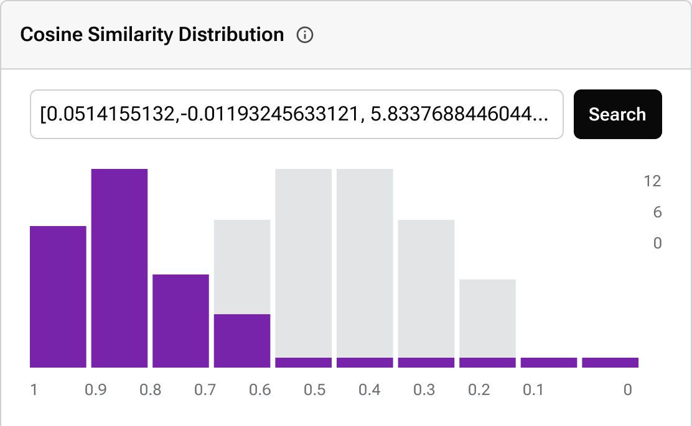

= {company} Astra
:page-layout: full
:vector-image: image::ROOT:ui/integrations-browser.png[Browser,420,220,align=center]

DataStax Astra is a cutting-edge cloud-native database platform designed to empower developers.
Harnessing the strengths of vector databases, serverless computing, and real-time streaming, Astra propels application development into the next generation.
From AI-driven capabilities to robust data stream management, Astra simplifies complex tasks, offering unparalleled performance and scalability.

[.ds-feature-buttons]
https://astra.datastax.com[Explore Astra Vector^,role="ds-button ds-button\--color-primary ds-button\--variant-solid"]
https://astra.datastax.com[Create Astra Account^,role="ds-button ds-button\--color-primary ds-button\--variant-outlined external"]

[.vector.header-noline.text-h1.row.border-bottom]
== Vector
--
[.landing-card-icon]

image:astra-vector-dark.svg[vector,20,role=for-dark]

Delve into a database optimized for AI-driven tasks.
Astra Vector is tailored to offer unparalleled precision, speed, and scalability for AI applications, transforming how your applications perceive and interact with data.

[.landing-a]
xref:astra-vector::index.adoc[Learn More About Astra Vector]
--

''''

[.grid]
--
[discrete]
=== Serverless C*

Delve deep into high-dimensional spaces with Astra Vector.
Engineered for AI-intensive tasks, it offers unparalleled precision, speed, and scalability.
Bring complex AI models into production with confidence, leveraging Astra's robust architecture.

[.landing-a]
https://docs.datastax.com/en/astra-serverless/docs/index.html[Discover Astra Serverless C*]

[.material-icons.landing-card-icon]
table_chart

--

[.grid]
--
[discrete]
=== Streaming

Harness real-time data with Astra Streaming.
Process, analyze, and act on data as it's generated.
Whether you're analyzing user behavior or monitoring systems, Astra Streaming delivers the real-time insights you need.

[.landing-a]
https://docs.datastax.com/en/streaming/astra-streaming/index.html[Dive into Astra Streaming]

[.material-icons.landing-card-icon]
air

--

[.header-noline.text-h1.ds-row.ds-grid]
== Explore More of Astra

=== Dive Deeper into Vector

Get a broader understanding of vector databases and their capabilities within Astra.

[unstyled.landing-a]
* link:{#}[Vector Basics and Concepts]
* link:{#}[Advanced Vector Techniques]
* link:{#}[Vector Search Optimization]

=== Serverless C* Unveiled

Explore the intricacies and features of Astra's serverless database offering.

[unstyled.landing-a]
* link:{#}[Understanding CDC in Serverless C*]
* link:{#}[Clients, CLI, and Tools for Serverless C*]
* link:{#}[Serverless C* Best Practices]

=== Streaming Insights

Delve deeper into the real-time data processing capabilities of Astra.

[unstyled.landing-a]
* link:{#}[Streaming Fundamentals]
* link:{#}[Advanced Streaming Configurations]
* link:{#}[Starlight Integrations: JMS, Kafka, RabbitMQ]