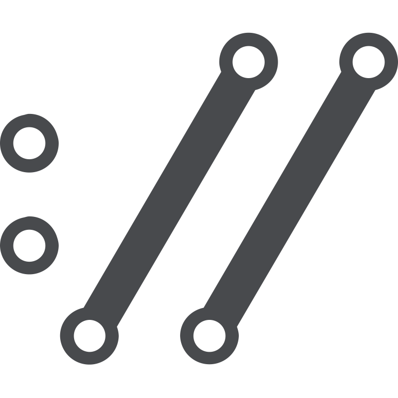
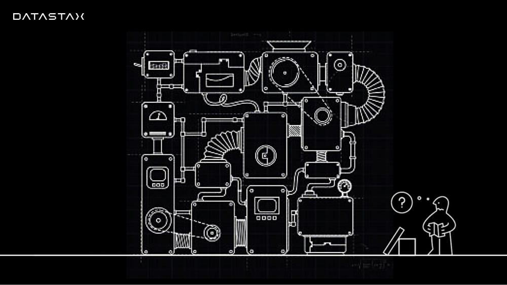

= Document Title (Level 0)
:description: The component style guide for the DataStax Docs UI. All major AsciiDoc components are represented, including admonitions, tables, lists, and more.
:keywords: AsciiDoc, Antora, UI, style guide
:idprefix:
:idseparator: -
:!example-caption:
:!table-caption:
:page-pagination:
:experimental:
:stem: latexmath
:tabs-sync-option:
:tabs-sync-storage-key: tabs
:tabs-sync-storage-scope: session
:cassandra-icon: 
:java-icon: image:java-original.svg[,22]
:python-icon: image:python-original.svg[,22]
:shell-icon: 

In AsciiDoc, creating paragraphs is a straightforward process that does not require any special markup.
A paragraph can be defined as one or more lines of consecutive text that are logically grouped together.
To differentiate between paragraphs, you simply need to insert at least one blank line between them.

xref:vector-home.adoc[Vector Home,role="btn btn-primary btn-solid"]

== Level 1 section title

[.rolename]
=== Level 2 section title

==== Level 3 section title

===== Level 4 section title

====== Level 5 section title

[discrete]
== Level 1 section title (Discrete)

[.rolename]
=== Example: Section title w/ custom role

////
When the document type is article (the default), the document can only have one level 0 section title (`=`), which is the document title (i.e., doctitle).

When a page is converted to HTML, each section title becomes a heading element where the heading level matches the number of equals signs.
For example, a level 1 section (`==`) maps to an `<h2>` HTML tag.

Each section title has an auto-generated section ID that forms the fragment identifier for the section.
The auto-generated section ID is a URL-safe version of the section title, converted to lowercase, with all non-alphanumeric characters replaced with hyphens (controlled by the `idprefix` and `idseparator` attributes).
An anchor (empty link) is added before the section title, and an anchor icon floats to the left of the section title (controlled by the `sectanchors` attribute).

Section titles appear in the page table of contents (TOC) in the order they appear in the document.
The depth of the page TOC can be configured using the `page-toclevels` attribute.

A `discrete` heading is declared and styled in a manner similar to that of a section title, but it’s not part of the section hierarchy and not included in the table of contents,etc.
////

[#text-formatting]
== Text formatting

Nominavi luptatum eos, an vim hinc philosophia intellegebat.
Lorem pertinacia `expetenda` et nec, [.underline]#wisi# illud [.line-through]#sonet# qui ea.
H~2~0.
E = mc^2^.

[cols="1,2a",frame=none,grid=none]
|===
|Constrained bold, italic, and monospace
|It has *strong* significance to me.

I _cannot_ stress this enough.

Type `OK` to accept.

That *_really_* has to go.

Can't pick one? Let's use them `*_all_*`.

|Unconstrained bold, italic, and monospace
|**C**reate, **R**ead, **U**pdate, and **D**elete (CRUD)

That's fan__freakin__tastic!

Don't pass generic ``Object``s to methods that accept ``String``s!

It was Beatle**__mania__**!

|Highlight, underline, strikethrough, and custom role
|Mark my words, #automation is essential#.

##Mark##up refers to text that contains formatting ##mark##s.

Where did all the [.underline]#cores# go?

We need [.line-through]#ten# twenty VMs.

A [.myrole]#custom role# must be fulfilled by the theme.

|Superscript and subscript
|^super^script

~sub~script

|Smart quotes and apostrophes
|"`double curved quotes`"

'`single curved quotes`'

Olaf's desk was a mess.

A ``std::vector```'s size is the number of items it contains.

All of the werewolves`' desks were a mess.

Olaf had been with the company since the `'00s.
|===

=== Links

==== Internal link

Instead of having to enclose text within <<text-formatting,tags or special characters>>, you can focus on expressing your ideas and content in a clear and concise manner.

==== External link

By separating paragraphs with blank lines, you visually https://www.datastax.com[distinguish each paragraph,role=external,window=_blank]

By separating paragraphs with blank lines, you visually https://www.datastax.com[distinguish each paragraph^]

By separating paragraphs with blank lines, you visually https://www.datastax.com[distinguish each paragraph]

////
An _external link_ is any link that targets an address outside of the docs.datastax.com subdomain.
External links should have the following behavior, regardless of any AsciiDoc attributes that a writer might apply to them:

* Different visual styling than an internal link, e.g. an `open_in_new` icon after the link text.
* Open in a new tab or window when clicked.

The links in the example sentences above all target the same external URL -- `\https://www.datastax.com`.
However, they each have different AsciiDoc attributes applied to them.

[source,asciidoc]
----
https://www.datastax.com[distinguish each paragraph,role=external,window=_blank]
https://www.datastax.com[distinguish each paragraph^]
https://www.datastax.com[distinguish each paragraph]
----

The UI should disregard these attributes and apply the same styling and behavior to each link.
////

==== Unresolved link

Vestibulum consectetur nec urna a luctus.
Quisque pharetra tristique arcu fringilla dapibus.
https://example.org[Curabitur,role=unresolved] ut massa aliquam, cursus enim et, accumsan lectus.
Mauris eget leo nunc, nec tempus mi? Curabitur id nisl mi, ut vulputate urna.

=== Keyboard, button, and menu macros

To save the file, select menu:File[Save].
Select menu:View[Zoom > Reset] to reset the zoom level to the default setting.

Press the btn:[OK] button when you are finished.
Select a file in the file navigator and click btn:[Open].

Press kbd:[F11] to toggle fullscreen.
Press kbd:[Ctrl+T] to open a new tab.

=== Footnote

Eum an doctus maiestatis efficiantur.
Eu mea inani iriure.footnote:[Quisque porta facilisis tortor, vitae bibendum velit fringilla vitae! Lorem ipsum dolor sit amet, consectetur adipiscing elit.]


[#lists]
== Lists

=== Unordered list

* List item
** Nested list item
*** Deeper nested list item
* List item
 ** Another nested list item
* List item

.Unordered list max level nesting
* Level 1 list item
** Level 2 list item
*** Level 3 list item
**** Level 4 list item
***** Level 5 list item
****** etc.
* Level 1 list item

=== Ordered list

. Step 1
. Step 2
.. Step 2a
.. Step 2b
. Step 3

.Ordered list max level nesting
. Level 1 list item
.. Level 2 list item
... Level 3 list item
.... Level 4 list item
..... Level 5 list item
. Level 1 list item

==== Ordered list numeration styles

[.scrolltable]
--
[cols="6*a"]
|===
|`decimal`
|`loweralpha`
|`upperalpha`
|`lowerroman`
|`upperroman`
|`lowergreek`

a|[decimal]
. Protons
. Electrons
. Neutrons

a|[loweralpha]
. Protons
. Electrons
. Neutrons

a|[upperalpha]
. Protons
. Electrons
. Neutrons

a|[lowerroman]
. Protons
. Electrons
. Neutrons

a|[upperroman]
. Protons
. Electrons
. Neutrons

a|[lowergreek]
. Protons
. Electrons
. Neutrons
|===
--

.Ordered list w/ customized numeration
[upperalpha]
. potenti donec cubilia tincidunt
. etiam pulvinar inceptos velit quisque aptent himenaeos
. lacus volutpat semper porttitor aliquet ornare primis nulla enim

Natum facilisis theophrastus an duo.
No sea, at invenire voluptaria mnesarchum has.

.Unordered list w/ customized marker
[square]
* ultricies sociosqu tristique integer
* lacus volutpat semper porttitor aliquet ornare primis nulla enim
* etiam pulvinar inceptos velit quisque aptent himenaeos

=== Description list

First term:: Description of the first term.
Second term:: Description of the second term.
+
With another paragraph.
Third term::
Description of the first term.

==== Horizontal description list (unconstrained)

[horizontal]
CPU:: The brain of the computer.
Hard drive:: Permanent storage for operating system and/or user files.
+
Solid state drives (SSDs) are faster than hard drives, but are also more expensive.
RAM::
Temporarily stores information the CPU uses during operation.

==== Horizontal description list (constrained)

[horizontal,labelwidth=25,itemwidth=75]
A short term:: The term for this item likely fits inside the column's width.
A long term that wraps across multiple lines:: The term for this item wraps since the width of the term column is restricted using the `labelwidth` attribute.

==== Question and Answer List

[qanda]
What is the answer?::
This is the answer.

Are cameras allowed?::
Are backpacks allowed?::
No.

=== Checklist

* [*] checked
* [x] also checked
* [ ] not checked

.Interactive checklist
[%interactive]
* [*] checked
* [x] also checked
* [ ] not checked

=== Example: Mixed list

Operating Systems::
  Linux:::
    . Fedora
      * Desktop
    . Ubuntu
      * Desktop
      * Server
  BSD:::
    . FreeBSD
    . NetBSD

Cloud Providers::
  PaaS:::
    . OpenShift
    . CloudBees
  IaaS:::
    . Amazon EC2
    . Rackspace

=== Example: Complex lists

.Drop the principal text
. {empty}
+
----
print("one")
----
. {empty}
+
----
print("one")
----

.List continuation
* Every list item has at least one paragraph of content,
  which may be wrapped, even using a hanging indent.
+
Additional paragraphs or blocks are adjoined by putting
a list continuation on a line adjacent to both blocks.

* A literal paragraph does not require a list continuation.

 $ cd projects/my-book

* The header in AsciiDoc must start with a document title.
+
----
= Document Title
----
+
Keep in mind that the header is optional.

** The header in AsciiDoc must start with a document title.
+
--
----
= Document Title
----

NOTE: The header is optional.
--

* AsciiDoc lists may contain any complex content.
+
|===
|Column 1, Header Row |Column 2, Header Row

|Column 1, Row 1
|Column 2, Row 1
|===

== Code

=== Inline code

Output literal monospace text, such as `my-python-function` or `initial-scale=1.0`.

=== Code blocks

[source,json]
----
{
  "name": "module-name",
  "version": "10.0.1",
  "description": "An example module to illustrate the usage of package.json",
  "author": "Author Name <author@example.com>",
  "scripts": {
    "test": "mocha",
    "lint": "eslint"
  }
}
----

.Console code block
[source,console]
----
$ pip install astra-vector
$ python3
----

.Wrap text code block
[source,java,role="wrap"]
----
public class ApplicationConfigurationProvider extends HttpConfigurationProviderHttpConfigurationProviderHttpConfigurationProviderHttpConfigurationProviderHttpConfigurationProvider
----

.Hide language title code block
[source,,role="hidelang"]
----
I don't have a language title bar!
----

=== Callouts

[source,js]
----
vfs
  .src('js/vendor/*.js', { cwd: 'src', cwdbase: true, read: false })
  .pipe(tap((file) => { // <.>
    file.contents = browserify(file.relative, { basedir: 'src', detectGlobals: false }).bundle()
  }))
  .pipe(buffer()) // <.>
  .pipe(uglify())
  .pipe(gulp.dest('build'))
----
<.> The `tap` function is used to wiretap the data in the pipe.
<.> Wrap each streaming file in a buffer so the files can be processed by uglify.
Uglify can only work with buffers, not streams.

== Tabset

[tabs]
======
Tab A:: Contents of Tab A.

Tab B::
+
Contents of Tab B.

Tab C::
+
--
Contents of Tab C.

Contains more than one block.
--
======

=== Example: Overflow tabset

[tabs.overflow]
======
Tab Name:: Contents of Tab.

Longer Tab Name::
+
Contents of Longer Tab.

An Even Longer Tab Name::
+
Contents of Even Longer Tab.

This Is The Longest Tab Name::
+
Contents of The Longest Tab.
======

[tabs.wrapping]
======
Tab Name:: Contents of Tab.

Longer Tab Name::
+
Contents of Longer Tab.

An Even Longer Tab Name::
+
Contents of Even Longer Tab.

This Is The Longest Tab Name::
+
Contents of The Longest Tab.
======

=== Example: Complex tabset

[tabs]
======
Tarball::
+
. If you haven't already, start by downloading the Cassandra binary tarball.
For example, to download Cassandra 4.1.2:
+
[tabs]
====
cURL::
+
--
[source,shell,subs="attributes+"]
----
curl -OL https://archive.apache.org/dist/cassandra/4.1.2/apache-cassandra-4.1.2-bin.tar.gz
----
--

Wget::
+
--
[source,shell,subs="attributes+"]
----
wget https://archive.apache.org/dist/cassandra/4.1.2/apache-cassandra-4.1.2-bin.tar.gz
----
--
====
+
[NOTE]
====
To download a different version of Cassandra, visit the https://archive.apache.org/dist/cassandra/[Apache Archives].
====
+
. (Optional) Verify the integrity of the downloaded tarball using one of the methods https://www.apache.org/dyn/closer.cgi#verify[here^].
+
.. For example, to verify the SHA256 hash of the downloaded file using GPG:
+
[source,shell,subs="attributes+"]
----
gpg --print-md SHA256 apache-cassandra-4.1.2-bin.tar.gz
----
+
.. Compare the output with the contents of the SHA256 file:
+
[source,shell,subs="attributes+"]
----
curl -L https://archive.apache.org/dist/cassandra/4.1.2/apache-cassandra-4.1.2-bin.tar.gz.sha256
----

Debian::
+
. (Optional) Verify the integrity of the downloaded tarball using one of the methods https://www.apache.org/dyn/closer.cgi#verify[here^].
+
.. For example, to verify the SHA256 hash of the downloaded file using GPG:
+
[tabs]
====
Command::
+
--
[source,shell,subs="attributes+"]
----
gpg --print-md SHA256 apache-cassandra-4.1.2-bin.tar.gz
----
--

Result::
+
--
[source,console,subs="attributes+"]
----
apache-cassandra-4.1.2-bin.tar.gz: 7CE3103A 76B8AF76 FFD8488D 6BF484E1 F1751196
                                   17F3205A E0526C71 D816C6F7
----
--
====
+
.. Compare the output with the contents of the SHA256 file:
+
[tabs]
====
cURL::
+
--
[source,shell,subs="attributes+"]
----
curl -L https://archive.apache.org/dist/cassandra/4.1.2/apache-cassandra-4.1.2-bin.tar.gz.sha256
----
--

Wget::
+
--
[source,shell,subs="attributes+"]
----
wget --quiet -O - https://archive.apache.org/dist/cassandra/4.1.2/apache-cassandra-4.1.2-bin.tar.gz.sha256
----
--

Result::
+
--
[source,console]
----
7ce3103a76b8af76ffd8488d6bf484e1f175119617f3205ae0526c71d816c6f7
----
--
====

CentOS:: Just text.
======

=== Experimental: Tabset icons

[tabs]
======
{cassandra-icon} CQL::
+
[source,sql]
----
USE cycling;
CREATE TABLE rank_by_year_and_name (
  race_year int,
  race_name text,
  cyclist_name text,
  rank int,
  PRIMARY KEY ((race_year, race_name), rank)
);
----

{python-icon} Python::
+
[source,python]
----
    log.info("creating table...")
    session.execute("""
        CREATE TABLE IF NOT EXISTS cyclist_by_year_and_name (
            race_year int,
            race_name text,
            rank int,
            cyclist_name text,
            PRIMARY KEY ((race_year,race_name),rank)
        )
        """)
----

{java-icon} Java::
+
[source,java]
----
CreateTable create = createTable("cycling", "cyclist_by_year_and_name")
    .withPartitionKey("race_year", DataTypes.INT)
    .withPartitionKey("race_name", DataTypes.TEXT)
    .withClusteringColumn("rank", DataTypes.INT)
    .withColumn("cyclist_name", DataTypes.TEXT);
// CREATE TABLE cycling.cyclist_by_year_and_name (race_year int,race_name text,rank int,cyclist_name text,PRIMARY KEY((race_year,race_name),rank))
----

{shell-icon} REST API::
+
[source,json]
----
curl -s --location \
--request POST http://localhost:8082/v2/schemas/keyspaces/cycling/tables \
--header "X-Cassandra-Token: $AUTH_TOKEN" \
--header "Content-Type: application/json" \
--header "Accept: application/json" \
--data '{
	"name": "cyclist_by_year_and_name",
	"columnDefinitions":
	  [
        {
	      "name": "race_year",
	      "typeDefinition": "int"
	    },
        {
	      "name": "race_name",
	      "typeDefinition": "text"
	    },
        {
	      "name": "rank",
	      "typeDefinition": "int"
	    }
        ,
        {
          "name": "cyclist_name",
          "typeDefinition": "text"
        }
	  ],
	"primaryKey":
	  {
	    "partitionKey": ["race_year", "race_name"],
	    "clusteringKey": ["rank"]
	  },
	"tableOptions":
	  {
	    "defaultTimeToLive": 0,
	    "clusteringExpression":
	      [{ "column": "rank", "order": "ASC" }]
	  }
}'
----
======

== Admonitions

NOTE: An admonition draws the reader's attention to auxiliary information.

IMPORTANT: Sign off before stepping away from your computer.

TIP: Look for the warp zone under the bridge.

CAUTION: Slippery when wet.

WARNING: The software you're about to use is untested.

.Complex admonition
[NOTE]
====
An admonition block may contain complex content, like <<lists,lists>> and <<tables,tables>>.

.A list
* List item
** Nested list item
*** Deeper nested list item
* List item
 ** Another nested list item
* List item

.A table
[cols="3*"]
|===
|Cell in column 1, row 1
|Cell in column 2, row 1

|Cell in column 1, row 2
|Cell in column 2, row 2

|Cell in column 1, row 3
|Cell in column 2, row 3
|===

.A code block
[source,js]
----
vfs
  .src('js/vendor/*.js', { cwd: 'src', cwdbase: true, read: false })
  .pipe(tap((file) => { // <.>
    file.contents = browserify(file.relative, { basedir: 'src', detectGlobals: false }).bundle()
  }))
----
<.> Maybe with a callout.

.Another admonition
[TIP]
======
Admonition styles are set on example blocks, which are delimited by four equal signs (`====`).
When nesting a delimited block that uses the same structural container, it's necessary to vary the length of the delimiter lines (i.e., make the length of the delimiter lines for the child block different than the length of the delimiter lines for the parent block).
Varying the delimiter line length allows the parser to distinguish one block from another.
======
====

[#tables]
== Tables

.Basic table
[cols="3*"]
|===
|Cell in column 1, row 1
|Cell in column 2, row 1
|Cell in column 3, row 1

|Cell in column 1, row 2
|Cell in column 2, row 2
|Cell in column 3, row 2

|Cell in column 1, row 3
|Cell in column 2, row 3
|Cell in column 3, row 3
|===

.Table w/ header row
[%autowidth.stretch]
|===
|Column 1, header row |Column 2, header row |Column 3, header row

|Cell in column 1, row 2
|Cell in column 2, row 2
|Cell in column 3, row 2

|Cell in column 1, row 3
|Cell in column 2, row 3
|Cell in column 3, row 3
|===

.Table w/ header row, footer row, and autowidth
[#dependencies%footer%autowidth]
|===
|Library |Version

|eslint
|^1.7.3

|eslint-config-gulp
|^2.0.0

|expect
|^1.20.2

|istanbul
|^0.4.3

|istanbul-coveralls
|^1.0.3

|jscs
|^2.3.5

h|Total
|6
|===

=== Example: Complex tables

.Table w/ header row, variable column widths, and AsciiDoc content
[cols="1,1,2a"]
|===
|Name |Category |Description

|Firefox
|Browser
|Mozilla Firefox is an open source web browser.

image::firefox-window.png[Screenshot of Firefox window]

It's designed for:

* standards compliance
* performance
* portability

image::https://upload.wikimedia.org/wikipedia/commons/a/a0/Firefox_logo%2C_2019.svg[Firefox logo,align=left,link=https://getfirefox.com]
https://getfirefox.com[Get Firefox]!

|Arquillian
|Testing
|An innovative and highly extensible testing platform.
Empowers developers to easily create real, automated tests.

Each Arquillian test is associated with at least one deployment.

[NOTE]
====
The deployment is configured using a static method annotated with @Deployment that returns a ShrinkWrap archive. Here’s an example:

[source,java]
----
@Deployment
public static JavaArchive createDeployment() {
    return ShrinkWrap.create(JavaArchive.class)
        .addClass(Greeter.class)
        .addAsManifestResource(EmptyAsset.INSTANCE, "beans.xml");
}
----
====
|===

.Table w/ formatted, aligned, and merged cells
[cols="e,m,^,>s"]
|===
|1 >s|2 |3 |4
^|5 2.2+^.^|6 .3+<.>m|7
^|8
|9 2+>|10
|===

.Table w/ `frame=none`, `grid=none`
[frame=none, grid=none]
|===
|Column 1, header row |Column 2, header row |Column 3, header row

|Cell in column 1, row 2
|Cell in column 2, row 2
|Cell in column 3, row 2

|Cell in column 1, row 3
|Cell in column 2, row 3
|Cell in column 3, row 3
|===

.Nested table
[cols="1,2a"]
|===
| Col 1 | Col 2

| Cell 1.1
| Cell 1.2

| Cell 2.1
| Cell 2.2

[cols="2,1"]
!===
! Col1 ! Col2

! C11
! C12

!===
|===

.Striped table (even striping)
[cols=2*,stripes=even]
|===
|A1
|B1
|A2
|B2
|A3
|B3
|===

.Striped table (hover striping)
[cols=2*,stripes=hover]
|===
|A1
|B1
|A2
|B2
|A3
|B3
|===


== Images

=== Images for Light and Dark modes

[source,adoc]
----
[.for-light]
image::your-light-image.png[Description]
[.for-dark]
image::your-dark-image.png[Description]

// You can also define the role within the macro itself

image::light-mode-illustration.png[Description,role=for-light]

----

[.for-light]
image::light-mode-illustration.png[Description,400]
[.for-dark]


=== SVG with CSS variables for Light and Dark modes

.Currently unsupported
[WARNING]
====
The method described below for embedding an SVG directly into the HTML won't work until Antora adds support for the `opts=inline` option (see https://gitlab.com/antora/antora/-/issues/1001).
Therefore, unless a suitable workaround is discovered, we can't support SVGs with CSS variables until Antora fixes this issue.
====

[source,svg]
----
<svg viewBox="0 0 300 200" fill="none">
  <path fill="var(--ds-text-primary)" d="..." />
  <path stroke="var(--ds-primary-outlined-border)" d="..." />
  <path fill="var(--ds-neutral-outlined-border)" d="..." />
</svg>
----

[source,adoc]
----
image::your-diagram.svg[Description,300,opts=inline] <1>
----

<1> The `opts=inline` attribute is required to embed the SVG directly into the HTML.

image::preview-src/simple-diagram.svg[Simple Diagram,192,opts=inline]

=== Inline images

Click image:play_circle_FILL0_wght400_GRAD0_opsz24.svg[title=Play] to get the party started.

Click image:pause_circle_FILL0_wght400_GRAD0_opsz24.svg[title=Pause] when you need a break.

=== Block images

.Bitmap image (unconstrained; default alignment)
image::screenshot.png[Screenshot of Astra Portal Home]

.Bitmap image (300px width; default alignment)
image::screenshot.png[Screenshot of Astra Portal Home,300]

.SVG image (300px width; default alignment). Image is rasterized (`opts=` _none_).
image::preview-src/multirepo-ssg.svg[Multirepo SSG,300]

.SVG image (300px width; default alignment). Image embedded as a live, interactive object (`opts=interactive`).
image::preview-src/multirepo-ssg.svg[Multirepo SSG,300,opts=interactive]

.SVG image (300px width; default alignment). Image embedded directly into the HTML itself (`opts=inline`).
image::preview-src/multirepo-ssg.svg[Multirepo SSG,300,opts=inline]

==== Aligning block images

.Bitmap image (aligned left)
image::screenshot.png[Screenshot of Astra Portal Home,300,align="left"]

.Bitmap image (aligned right)
image::screenshot.png[Screenshot of Astra Portal Home,300,align="right"]

.Bitmap image (aligned center)
image::screenshot.png[Screenshot of Astra Portal Home,300,align="center"]

==== Floating block images

[.float-group]
--
image:screenshot.png[Screenshot of Astra Portal Home,300,float=right,role=float-gap]
In AsciiDoc, creating paragraphs is a straightforward process that does not require any special markup. A paragraph can be defined as one or more lines of consecutive text that are logically grouped together. To differentiate between paragraphs, you simply need to insert at least one blank line between them.
--

[.float-group]
--
image::multirepo-ssg.svg[Multirepo SSG,300,float=left,role=float-gap]
In AsciiDoc, creating paragraphs is a straightforward process that does not require any special markup. A paragraph can be defined as one or more lines of consecutive text that are logically grouped together. To differentiate between paragraphs, you simply need to insert at least one blank line between them.
--

== Video

.YouTube (unconstrained; default alignment)
video::n_LcVqqHSY8[youtube]

.Vimeo (640x360; default alignment)
video::300817511[vimeo,640,360]

== Audio

.Take a zen moment
audio::ocean-waves.wav[]

== Collapsible block

.Basic collapsible block
[%collapsible]
====
Details.

Loads of details.
====

.Collapsible `code block`
[%collapsible]
====
[source,asciidoc]
----
Some code.
----
====

=== Collapsible results

[source,asciidoc]
----
Run this code.
----

.Result
[%collapsible.result]
====
[source,console]
----
Voila!
----
====

== Sidebar

.Sidebar title
****
Sidebars are used to visually separate auxiliary bits of content that supplement the main text.
****

== Horizontal rule

A line with three single quotation marks (i.e., `'''`) is a special macro that inserts a thematic break (aka horizontal rule):

'''

There are rare circumstances where a horizontal rule is required.

== More blocks

As you might have seen in the examples further up on this page -- any block can have a title.
A block title is defined using a line of text above the block that starts with a dot.
That dot cannot be followed by a space.
For block images, the title is displayed below the block.
For all other blocks, the title is typically displayed above it.

=== Example block

.Optional title
====
Here's a sample AsciiDoc document:

[source,asciidoc]
----
= Title of Document
Doc Writer
:toc:

This guide provides...
----

The document header is useful, but not required.
====

=== Listing block

.Optional title
----
This is a _delimited listing block_.

The content inside is displayed as <pre> text.
----

=== Literal block

.Optional title
....
error: 1954 Forbidden search
absolutely fatal: operation lost in the dodecahedron of doom
Would you like to try again? y/n
....

=== Blockquote

[,'Famous Person. Cum dicat putant ne.','Cum dicat putant ne. https://example.com[Famous Person Website]']
____
Lorem ipsum dolor sit amet, consectetur adipiscing elit.
Mauris eget leo nunc, nec tempus mi? Curabitur id nisl mi, ut vulputate urna.
Quisque porta facilisis tortor, vitae bibendum velit fringilla vitae!
Lorem ipsum dolor sit amet, consectetur adipiscing elit.
Mauris eget leo nunc, nec tempus mi? Curabitur id nisl mi, ut vulputate urna.
Quisque porta facilisis tortor, vitae bibendum velit fringilla vitae!
____

=== Verse

[verse]
____
The fog comes
on little cat feet.
____

== Equations and formulas (STEM)

=== Inline stem macro

stem:[sqrt(4) = 2]

Water (stem:[H_2O]) is a critical component.

A matrix can be written as stem:[[[a,b\],[c,d\]\]((n),(k))].

=== Block STEM content

[stem]
++++
sqrt(4) = 2
++++

=== Mixing STEM notations

.An e-xciting limit with LaTeX!
[stem]
++++
\lim_{n \to \infty}\frac{n}{\sqrt[n]{n!}} = {\large e}
++++

.A basic square root with AsciiMath
[asciimath]
++++
sqrt(4) = 2
++++

== Miscellaneous

=== Textual symbol replacements

[%autowidth,cols="~,^~,^~,^~,~"]
|===
|Name |Syntax |Unicode Replacement |Rendered |Notes

|Copyright
|+(C)+
|+&#169;+
|(C)
|

|Registered
|+(R)+
|+&#174;+
|(R)
|

|Trademark
|+(TM)+
|+&#8482;+
|(TM)
|

|Em dash
|+--+
|+&#8212;+
|{empty}--{empty}
|Only replaced if between two word characters, between a word character and a line boundary, or flanked by spaces.

When flanked by space characters (e.g., `+a -- b+`), the normal spaces are replaced by thin spaces (\&#8201;).
Otherwise, the em dash is followed by a zero-width space (\&#8203;) to provide a break opportunity.

|Ellipsis
|+...+
|+&#8230;+
|...
|The ellipsis is followed by a zero-width space (\&#8203;) to provide a break opportunity.

|Single right arrow
|+->+
|+&#8594;+
|->
|

|Double right arrow
|+=>+
|+&#8658;+
|=>
|

|Single left arrow
|+<-+
|+&#8592;+
|<-
|

|Double left arrow
|+<=+
|+&#8656;+
|<=
|

|Typographic apostrophe
|Sam\'s
|+Sam&#8217;s+
|Sam's
|The typewriter apostrophe is replaced with the typographic (aka curly or smart) apostrophe.
|===

[#english+中文]
=== English + 中文

爱屋及乌 -- Love me, love my dog.

== Fin

That's all, folks!
