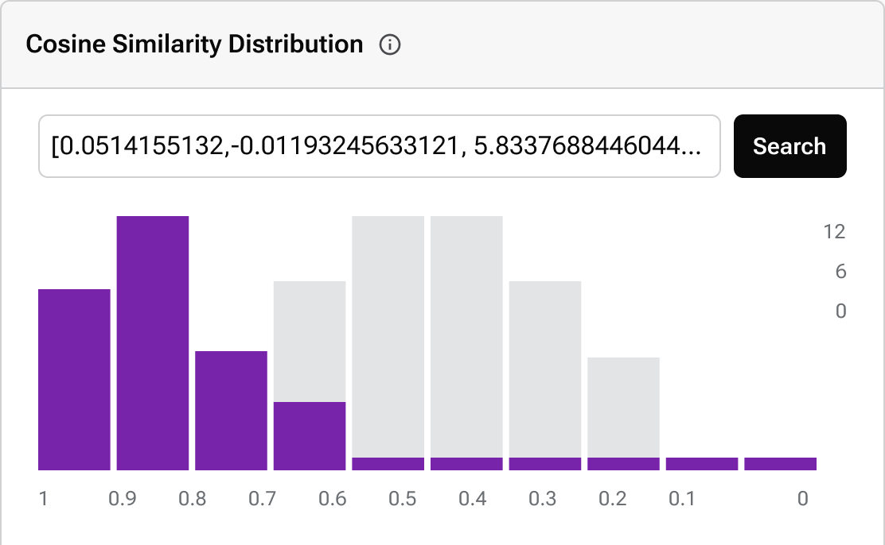
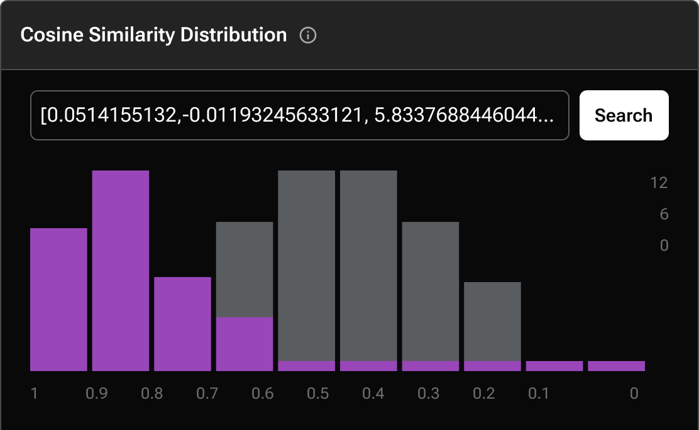

= {company} Astra
:page-layout: full

[.max-w-[650px]]
DataStax Astra is a cutting-edge cloud-native database platform designed to empower developers.
Harnessing the strengths of vector databases, serverless computing, and real-time streaming, Astra propels application development into the next generation.
From AI-driven capabilities to robust data stream management, Astra simplifies complex tasks, offering unparalleled performance and scalability.

[.[&>h2]:!hidden]
== {empty}

++++

++++

[discrete.!m-0]
== [.rounded-xl.border.p-1.flex.w-max.mb-1]#icon:../img/astra-database.svg[]# Vector

Delve into a database optimized for AI-driven tasks.
Astra Vector is tailored to offer unparalleled precision, speed, and scalability for AI applications, transforming how your applications perceive and interact with data.

xref:astra-db-vector:ROOT:index.adoc[Go to Vector Docs,role="btn btn-primary btn-solid inline-flex"]

++++

++++

++++

++++

[discrete.[&+hr]:!mt-2]
== Other Astra Products

''''

++++

++++

[discrete]
== [.rounded-xl.border.p-1.flex.w-max.mb-1]#icon:../img/astra-database.svg[]# Serverless

Delve deep into high-dimensional spaces with Astra Vector.
Engineered for AI-intensive tasks, it offers unparalleled precision, speed, and scalability. Bring complex AI models into production with confidence, leveraging Astra's robust architecture.

[.landing-a]
https://docs.datastax.com/en/astra-serverless/docs/index.html[Go to Serverless Docs]

++++

++++

[discrete]
== [.rounded-xl.border.p-1.flex.w-max.mb-1]#icon:../img/astra-streaming.svg[]# Streaming

Harness real-time data with Astra Streaming.
Process, analyze, and act on data as it's generated. Whether you're analyzing user behavior or monitoring systems, Astra Streaming delivers the real-time insights you need.

[.landing-a]
https://docs.datastax.com/en/streaming/astra-streaming/index.html[Go to Streaming Docs]

++++

++++
