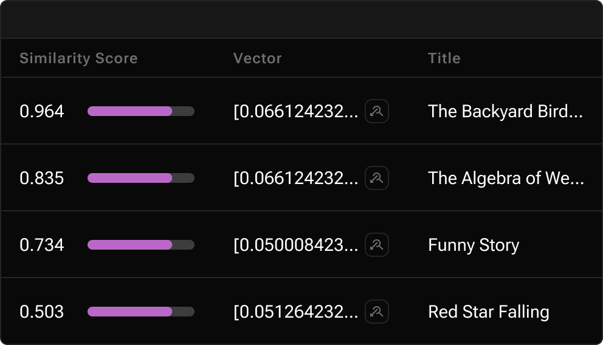

= {empty}
:page-layout: home

[.[&>h2]:!hidden]
== {empty}

[subs="macros,attributes"]
++++

  

    
    <h2 class="discrete !m-0">Astra DB Serverless</h2>
    
    
Astra DB Serverless by DataStax provides the tools developers need to create robust AI applications, featuring strong APIs, real-time data processing, and easy integration with other systems.

    

      <i class="material-icons icon">handyman</i>Vector Search
      <i class="material-icons icon">handyman</i>Modern APIs
      <i class="material-icons icon">handyman</i>Enterprise Ready
    

    
    

      xref:astra-db-serverless:get-started:quickstart.adoc[Quickstart <i class="material-icons icon ml-1">arrow_forward</i>,role="btn btn-primary btn-solid"]
      https://astra.datastax.com[Try Astra^,role="btn btn-neutral btn-outlined"]
    

  

  

++++

 h-[17.5rem] [&_img]:rounded drop-shadow-md for-dark"]
image::../img/vector-ui-light.png["Vector Database UI", role="absolute -bottom-12 !m-0 rounded w-[31rem] h-[17.5rem] [&_img]:rounded drop-shadow-md for-light"]

[source,python,subs="verbatim,quotes",role="nolang inverse-theme [&_.source-toolbox]:hidden rounded w-[31rem] h-[17.5rem] relative !-mt-0 !-mb-12 -top-12 right-10"]
----
from astrapy import DataAPIClient

# connect to a database
database = DataAPIClient(*TOKEN*).get_database_by_api_endpoint(*URL*)

# Ingest vectors into your collection
collection = database.test_collection
collection.insert_many(documents=*DOCUMENTS*)

# Find the closest vectors
collection.find(vector=[0.15, 0.1, 0.1, 0.35, 0.55])
----

[subs="macros,attributes"]
++++
  

<h3 class="discrete !my-12">Popular Products</h3>

  
  xref:astra-db-serverless::index.adoc[
    

    

      
<i class="icon material-icons">handyman</i>

      

        <h4 class="discrete !m-0 !text-primary">Astra DB Serverless</h4>
        
Scale with cloud-native databases

      

    

  ,role="!no-underline relative group"]

  xref:astra-db-serverless::index.adoc[
    

    

      
<i class="icon material-icons">timer</i>

      

        <h4 class="discrete !m-0 !text-primary">RAGStack</h4>
        
Build AI apps faster

      

    

  ,role="!no-underline relative group"]

  xref:astra-db-serverless::index.adoc[
    

    

      
<i class="icon material-icons">business</i>

      

        <h4 class="discrete !m-0 !text-primary">DSE</h4>
        
Enterprise scalability and performance

      

    

  ,role="!no-underline relative group"]

  xref:astra-db-serverless::index.adoc[
    

    

      
<i class="icon material-icons">space_dashboard</i>

      

        <h4 class="discrete !m-0 !text-primary">Mission Control</h4>
        
Manage your data ecosystem

      

    

  ,role="!no-underline relative group"]

  xref:astra-db-serverless::index.adoc[
    

    

      
<i class="icon material-icons">handyman</i>

      

        <h4 class="discrete !m-0 !text-primary">Streaming</h4>
        
Efficient data streaming

      

    

  ,role="!no-underline relative group"]

  xref:astra-db-serverless::index.adoc[
    

    

      
<i class="icon material-icons">handyman</i>

      

        <h4 class="discrete !m-0 !text-primary">Luna</h4>
        
Expertise and support for DataStax products

      

    

  ,role="!no-underline relative group"]

  <h3 class="pb-4 border-b !m-0">Latest Additions<i class="material-icons icon text-2xl">new_label</i></h3>

  xref:astra-db-serverless::index.adoc[
    

      <h4 class="discrete !m-0 !text-primary text-display">
        Loading data into Astra DB databases
        
          Astra DB
        
      </h4>
      
++Use the Astra DB Data Loader to load data in your database from a variety of sources, including CSV files, sample datasets, and Amazon DynamoDB.++

      
Read Loading data into Astra DB databases <i class="material-icons icon group-hover:translate-x-1 transition-transform duration-300">arrow_forward</i>

    

  ,role="!no-underline group flex flex-col"]

  xref:astra-db-serverless::index.adoc[
    

      <h4 class="discrete !m-0 !text-primary text-display">
        Optimizing Query Performance
        
          RAGStack
        
      </h4>
      
++Improve the efficiency of your queries on AI-ready cloud databases with best practices for indexing and query tuning.++

      
Read Optimizing Query Performance <i class="material-icons icon group-hover:translate-x-1 transition-transform duration-300">arrow_forward</i>

    

  ,role="!no-underline group flex flex-col"]

  xref:astra-db-serverless::index.adoc[
    

      <h4 class="discrete !m-0 !text-primary text-display">
        Securing Database Connections
        
          Astra DB
        
      </h4>
      
++Learn how to secure connections to your AI-ready cloud database using SSL encryption and access control methods.++

      
Read Securing Database Connections <i class="material-icons icon group-hover:translate-x-1 transition-transform duration-300">arrow_forward</i>

    

  ,role="!no-underline group flex flex-col"]

  <h3 class="pb-4 border-b !m-0">Working with AI/ML <i class="material-icons icon text-2xl">smart_toy</i></h3>

  xref:astra-db-serverless::index.adoc[
    

      <h4 class="discrete !m-0 !text-primary text-display">
        Automating Backups and Recovery
        
          Astra DB
        
      </h4>
      
++Set up automated backups for your cloud database and learn how to quickly recover your data in case of loss or corruption.++

      
Read Automating Backups and Recovery <i class="material-icons icon group-hover:translate-x-1 transition-transform duration-300">arrow_forward</i>

    

  ,role="!no-underline group flex flex-col"]

  xref:astra-db-serverless::index.adoc[
    

      <h4 class="discrete !m-0 !text-primary text-display">
        Monitoring and Alerts
        
          Mission Control
        
      </h4>
      
++Monitor the health and performance of your cloud database with real-time analytics and set up alerts for potential issues.++

      
Read Monitoring and Alerts <i class="material-icons icon group-hover:translate-x-1 transition-transform duration-300">arrow_forward</i>

    

  ,role="!no-underline group flex flex-col"]

  xref:astra-db-serverless::index.adoc[
    

      <h4 class="discrete !m-0 !text-primary text-display">
        Scaling Your Database
        
          Astra DB
        
      </h4>
      
++Scale your AI-ready cloud database vertically or horizontally to meet changing workload demands and optimize performance.++

      
Read Scaling Your Database <i class="material-icons icon group-hover:translate-x-1 transition-transform duration-300">arrow_forward</i>

    

  ,role="!no-underline group flex flex-col"]

  
  xref:astra-db-serverless::index.adoc[
    <h4 class="discrete !m-0 !text-primary text-display">
      <i class="material-icons icon text-2xl">home</i>
      DataStax Home
    </h4>
    Go to the DataStax website
    <i class="material-icons icon absolute group-hover:translate-x-1 transition-transform duration-300">arrow_forward</i>
  ,role="!no-underline group"]

  xref:astra-db-serverless::index.adoc[
    <h4 class="discrete !m-0 !text-primary text-display">
      <i class="material-icons icon text-2xl">menu_book</i>
      Glossary
    </h4>
    Learn terminology used in DataStax products
    <i class="material-icons icon absolute group-hover:translate-x-1 transition-transform duration-300">arrow_forward</i>
  ,role="!no-underline group"]

  xref:astra-db-serverless::index.adoc[
    <h4 class="discrete !m-0 !text-primary text-display">
      <i class="material-icons icon text-2xl">support</i>
      Support
    </h4>
    Access support resources
    <i class="material-icons icon absolute group-hover:translate-x-1 transition-transform duration-300">arrow_forward</i>
  ,role="!no-underline group"]

  xref:astra-db-serverless::index.adoc[
    <h4 class="discrete !m-0 !text-primary text-display">
      <i class="material-icons icon text-2xl">downloading</i>
      Downloads
    </h4>
    Download installation files and drivers
    <i class="material-icons icon absolute group-hover:translate-x-1 transition-transform duration-300">arrow_forward</i>
  ,role="!no-underline group"]

++++

