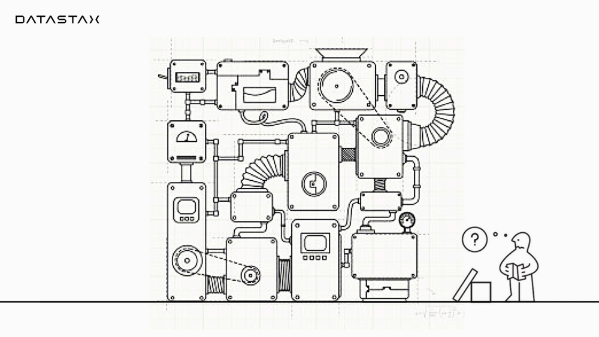

= Astra DB Serverless
:page-layout: landing

Astra DB Serverless empowers developers to build cutting-edge AI applications with robust APIs, real-time data handling, and seamless ecosystem integrations. Read our xref:get-started:concepts.adoc[introduction to vector databases] if you're new to Astra DB Serverless.

[.[&>h2]:!hidden]
== {empty}

[subs=macros,attributes]
++++

  

    
    <h2 class="discrete !text-h1 !m-0">Get started</h2>
    
    
Ready to work with Astra DB Serverless? Dive into the quickstart guide and learn how to create a database, connect, and load data in a matter of minutes.

    
    

      xref:get-started:quickstart.adoc[Quickstart,role="btn btn-primary btn-solid"]
      https://astra.datastax.com[Create Astra Account^,role="btn btn-neutral btn-outlined external"]
    

  

  

++++

[source,python,role="nolang absolute bottom-1/2 translate-y-1/2 right-0 w-full inverse-theme [&_.source-toolbox]:hidden"]
----
from astrapy.db import AstraDB

# Connect to a database
db = AstraDB(token=TOKEN, api_endpoint=URL)

# Ingest vectors into your collection
c = db.collection(collection_name="test")
c.insert_many(documents=DOCUMENTS)

# Find the closest vectors
c.vector_find([0.15, 0.1, 0.1, 0.35, 0.55])
----

[subs=macros,attributes]
++++
  

<h2 class="discrete !text-h1 !mt-12 !mb-6">Database basics</h2>

  

    
    <!--  -->
    

    <h3 class="discrete !text-h2 !m-0">Create database</h3>

    
Learn the fundamental steps of setting up your Astra DB database.

    

      xref:createdatabase.adoc[Create a database]
    

  

  

    
    <!--  -->
    

    <h3 class="discrete !text-h2 !m-0">Load data</h3>

    
Discover methods for loading data into Astra DB, ensuring it's structured and ready to use.

    

      xref:createdatabase.adoc[Load data]
    

  

  

  
    <!--  -->
    

    <h3 class="discrete !text-h2 !m-0">Explore</h3>

    
Explore your database, utilizing Astra DB's features for querying and analyzing your data.

    

      xref:createdatabase.adoc[Explore your data]
    

    
  

<h2 class="discrete !text-h1 !mt-12 !mb-6">Expand your Astra DB knowledge</h2>

  
  

      
    <!--  -->
    

    <h3 class="discrete !text-h2 !m-0">Integrations</h3>

    
Discover how Astra DB Serverless integrates with popular tools and platforms to enhance your workflow and data management.

    

      xref:createdatabase.adoc[Integrate LangChain with Astra DB]
    

    

      xref:createdatabase.adoc[Integrate LlamaIndex with Astra DB]
    

    

      xref:createdatabase.adoc[Integrate Vercel with Astra DB]
    

  

  

      
    
<i class="icon material-icons">auto_stories</i>

    <h3 class="discrete !text-h2 !m-0">Tutorials</h3>

    
Discover how Astra DB Serverless integrates with popular tools and platforms to enhance your workflow and data management.

    

      xref:createdatabase.adoc[Build a chatbot]
    

    

      xref:createdatabase.adoc[Build a recommendation system with vector search]
    

      
  

  

      
    
<i class="icon material-icons">handyman</i>

    <h3 class="discrete !text-h2 !m-0">API references</h3>

    
Utilize our detailed API references for a deep understanding of Astra DB's capabilities and how to effectively use them.

    

      xref:createdatabase.adoc[APIs for vector databases]
    

    

      xref:createdatabase.adoc[APIs for non-vector databases]
    

      
  

++++
